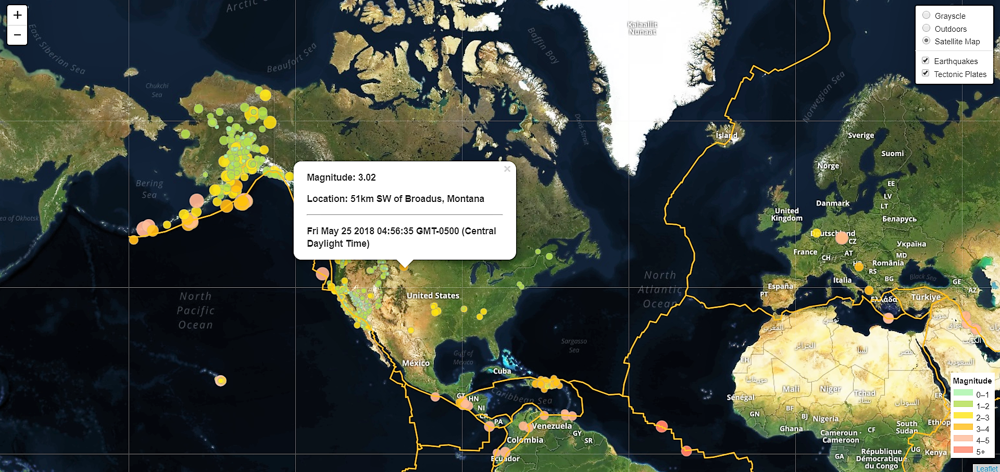

# Visualizing Earthquake Data with Leaflet

Created a map using Leaflet that plots all of the earthquakes in the last 7 days from the United States Geological Survey GeoJSON Feed page. Examined and illustrated the relationship between tectonic plates and seismic activity.

Languages and Tools:
- Leaflet
- HTML
- CSS
- Bootstrap
- JavaScript
- D3
- GeoJSON

